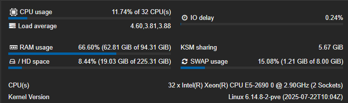
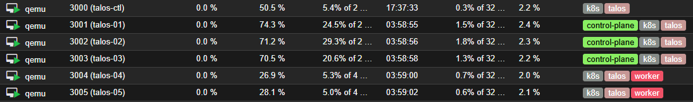

After much time wanting to get my hands on [Kubernetes](https://kubernetes.io/), I finally got around to setting it up on my homelab.

This blog post will cover the steps I took, the challenges I faced, and the solutions I found along the way and how finally got it all working and migrated some workloads to Kubernetes.

<!-- truncate -->

:::note
For the technical details, go to my separate documentation [here](https://example.com).
:::

## Why?

I always had an interest in container orchestration and wanted to learn more about how to manage containerized applications effectively and how to use them.

Kubernetes is the leading platform in this space, and very valuable for anyone looking to work with containers at scale, by setting it up on my homelab, besides the headaches, I aim to gain practical experience and deepen my understanding of Kubernetes concepts.

## My current setup

I deploy a lot of applications in my homelab, ranging from bare metal servers, virtual machines on [Proxmox VE](https://www.proxmox.com/en/products/proxmox-virtual-environment/overview), and some [Docker](https://www.docker.com/) stacks.

My main virtualization host is an old HP Z620 Workstation, it is a somewhat powerful, power hungry machine, but it gets the job done and gives me a lot of flexibility to run different workloads.



## The search for the right Kubernetes flavor

The main objective is to learn a somewhat enterprise-grade Kubernetes setup that can handle production workloads while being mindful of the limited resources available in my homelab. I explored various Kubernetes distributions and tools to find the right fit for my needs.

After much consideration, I decided to go with [Talos](https://talos.dev/), a modern, somewhat lightweight Kubernetes (actual k8s) distribution. The main selling points for me were:

- **Simplicity**: Talos contains the bare minimum required to run Kubernetes, which makes it easy to understand and manage.
- **Predictability**: Talos follows a strict configuration model, which reduces surprises and hopefully I will not need to manage the VM's as much.
- **Security**: Talos is designed with security in mind, it has a really small attack surface and is immutable by default, which aligns well with my security goals.

## Setting up Talos

Since I have the resources available, and if it isn't obvious by now, I decided to go with a virtualized setup. After downloading the [Talos ISO image](https://factory.talos.dev/), I uploaded it to my Proxmox VE environment.

### Virtual Machines

I will create a **5** machine cluster, with **3** control plane nodes and **2** worker nodes. **Control plane** nodes are responsible for managing the cluster, while **worker** nodes run the actual applications.

Here are the specifications for each node:

| Node Type     | CPU Cores | RAM  | Disk Size | Number |
|----------------|-----------|------|-----------|--------|
| Control Plane  | 2         | 4 GB | 40 GB     | 3      |
| Worker         | 4         | 8 GB | 120 GB    | 2      |

After setting up the virtual machines, they looked like this:



If you look closely, you can see an extra VM called **talos-ctl**, I created this to run the `talosctl` and the `kubectl` utilities without needing to install them on my local machine, it will also store the configuration files for the time being.

### IP Allocation 

Here is the IP allocation for each node in the cluster, they are all in the same subnet so no need for complicated routing:

| Node Name        | Node Type       | IP Address      | 
|------------------|-----------------|-----------------|
| talos-ctl        | Utility VM      | 10.10.0.49      |
| talos-01         | Control Plane   | 10.10.0.51      |
| talos-02         | Control Plane   | 10.10.0.52      |
| talos-03         | Control Plane   | 10.10.0.53      |
| talos-04         | Worker          | 10.10.0.54      |
| talos-05         | Worker          | 10.10.0.55      |

I reserved the IP addresses in my Unifi Network Controller to ensure they are always assigned to the correct VMs.

In addition to those IPs, I also reserved `10.10.0.50` for the control plane VIP, and a range in the `10.10.0.60's` for future use.

### The Talos cluster

Before creating our k8s environment, we need to configure the Talos cluster. This involves setting up the control plane and worker nodes, as well as configuring the networking and storage options.

:::note    
For way more detailed instructions, please refer to my documentation [here](example.com).
:::

This is actually a really simple process, after installing the [`talosctl`](https://www.talos.dev/v1.10/talos-guides/install/talosctl/) utility, we can generate the necessary secrets and configuration files.

```
talosctl gen secrets -o secrets.yaml
```

This generated the `secrets.yaml` file, which contains the necessary secrets for the cluster, as I said before, Talos

```
talosctl gen config name-of-cluster https://10.10.0.50:6443 \ 
  --with-secrets secrets.yaml \
  --install-disk /dev/sda \
  --output ./clusterconfig
```

This generated the configuration files for the cluster in `./clusterconfig`.

Edit the `./clusterconfig/controlplane.yaml` file to set the correct VIP and the nic settings.

```yaml title="controlplane.yaml"
machine:
  network:
    interfaces:
      - interface: eth0
        dhcp: true
        vip:
          ip: 10.10.0.50
```
Then, we can apply the configuration to each node:

```
# control planes (one by one)
talosctl apply-config --insecure -n 10.10.0.51 -f clusterconfig/controlplane.yaml
talosctl apply-config --insecure -n 10.10.0.52 -f clusterconfig/controlplane.yaml
talosctl apply-config --insecure -n 10.10.0.53 -f clusterconfig/controlplane.yaml

# workers
talosctl apply-config --insecure -n 10.10.0.54 -f clusterconfig/worker.yaml
talosctl apply-config --insecure -n 10.10.0.55 -f clusterconfig/worker.yaml
```
By now, your nodes should be installing and rebooting.

Setting up talosctl endpoints:

```
talosctl config endpoint 10.10.0.51 10.10.0.52 10.10.0.53
talosctl config nodes 10.10.0.51
```

Bootstrapping the cluster:

```
talosctl bootstrap -n 10.10.0.51
talos health
```

And boom! Your Talos cluster is up and running with k8s installed.

```
correia@talos-ctl:~/talos$ talosctl get members
NODE         NAMESPACE   TYPE     ID              VERSION   HOSTNAME        MACHINE TYPE   OS                ADDRESSES
10.10.0.51   cluster     Member   talos-9gj-92t   2         talos-9gj-92t   controlplane   Talos (v1.10.7)   ["10.10.0.50","10.10.0.51","2001:ipv6::11ff:fe02:3ff6"]
10.10.0.51   cluster     Member   talos-isd-h92   1         talos-isd-h92   worker         Talos (v1.10.7)   ["10.10.0.54","2001:ipv6::11ff:feaf:7ad8"]
10.10.0.51   cluster     Member   talos-jls-qix   1         talos-jls-qix   controlplane   Talos (v1.10.7)   ["10.10.0.53","2001:ipv6::11ff:fe1e:f8b0"]
10.10.0.51   cluster     Member   talos-l5m-ljy   1         talos-l5m-ljy   controlplane   Talos (v1.10.7)   ["10.10.0.52","2001:ipv6::11ff:fe26:46f0"]
10.10.0.51   cluster     Member   talos-v9n-17e   1         talos-v9n-17e   worker         Talos (v1.10.7)   ["10.10.0.55","2001:ipv6::11ff:fed2:fbec"]
```